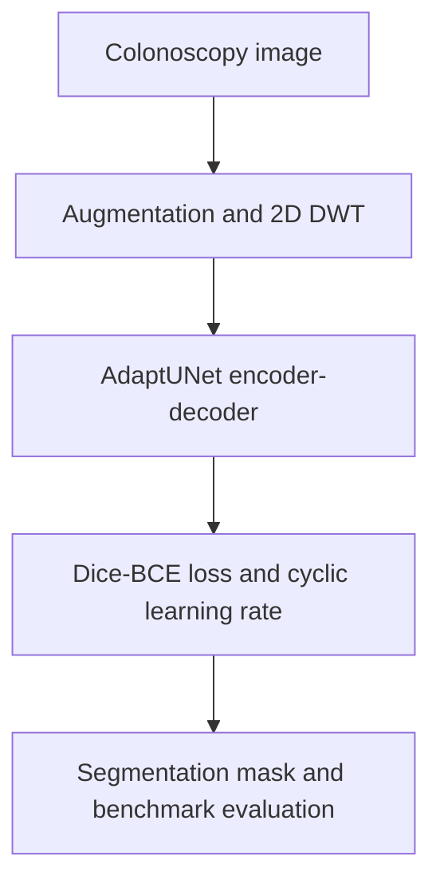

# AdaptUNet: Wavelet- and Attention-Enhanced U-Net for Polyp Segmentation

AdaptUNet is a modified U-Net for segmenting colorectal polyps in colonoscopy images. The method combines a single-level two-dimensional discrete wavelet transform with spatial and channel attention in the decoder, aiming to preserve fine boundary and texture information while focusing the network on relevant image regions.

This repository contains the original TensorFlow/Keras experiment notebook associated with the paper.

## Publication

**Efficient colorectal polyp segmentation using wavelet transformation and AdaptUNet: A hybrid U-Net**  
Devika Rajasekar, Girish Theja, Manas Ranjan Prusty, and Suchismita Chinara  
*Heliyon*, Volume 10, 2024, Article e33655

[Read the paper](https://doi.org/10.1016/j.heliyon.2024.e33655)

## Research question

Colorectal polyps vary substantially in size, shape, colour, texture, and boundary clarity. The project investigated whether frequency-aware preprocessing and attention-guided decoding could improve U-Net's ability to delineate polyps across several benchmark datasets.

## My contribution

I led the model development, methodology, data preparation, experiments, and manuscript development for this work and am the paper's first author. The published CRediT statement credits me with methodology, data curation, original drafting, and review and editing.

## Method



### Wavelet preprocessing

Each input image is decomposed with a single-level two-dimensional discrete wavelet transform into four coefficient groups:

- **LL:** low-frequency approximation
- **LH:** horizontal detail
- **HL:** vertical detail
- **HH:** diagonal detail

The components are resized to 256 x 256, concatenated as channels, and normalised before entering the network. This gives the model access to multi-scale intensity, edge, and texture information.

### AdaptUNet architecture

The model retains U-Net's encoder-decoder structure and skip connections, with additional decoder blocks that combine:

- spatial attention to emphasise relevant image locations;
- channel attention to reweight feature maps;
- upsampling and skip-connected encoder features to recover spatial detail.

Training uses a combined Dice and binary cross-entropy loss to balance region overlap with pixel-level classification. A cyclic learning-rate schedule varies the learning rate during optimisation.

## Data and evaluation

The paper trains AdaptUNet on segmented HyperKvasir images and reports evaluation on four polyp-segmentation benchmarks:

- CVC-300
- CVC-ColonDB
- Kvasir-SEG
- ETIS-LaribDB

The primary metrics are Dice coefficient, Intersection over Union (IoU), and balanced accuracy.

### Headline results

| Dataset | Dice | IoU | Balanced accuracy |
|---|---:|---:|---:|
| CVC-300 | **0.9104** | **0.8368** | **0.9880** |
| Kvasir-SEG | 0.8749 | 0.7883 | 0.9601 |
| ETIS-LaribDB | **0.8075** | **0.7215** | **0.9687** |

Within the comparison table reported in the paper, AdaptUNet achieved the highest Dice, IoU, and balanced-accuracy values on CVC-300 and ETIS-LaribDB. Results on Kvasir-SEG were competitive but did not lead every metric.

Cross-paper comparisons should be interpreted as benchmark context rather than a fully controlled head-to-head experiment because the compared studies may use different preprocessing and data partitions.

## Ablation study

The CVC-300 ablation study evaluates the contribution of wavelet preprocessing and the additional decoder blocks.

| Configuration | Dice | IoU | Balanced accuracy |
|---|---:|---:|---:|
| Complete AdaptUNet | **0.9104** | **0.8368** | **0.9880** |
| Without wavelet transform | 0.0815 | 0.0429 | 0.7185 |
| Without additional decoder blocks | 0.0649 | 0.0338 | 0.6522 |
| Without both components | 0.0635 | 0.0331 | 0.6487 |

The ablations show that the reported performance depends on both the frequency-domain input representation and the modified decoder. See the paper for the full experimental discussion and comparison tables.

## Repository contents

- [`Polyp-Segmentation-AdaptUNet.ipynb`](Polyp-Segmentation-AdaptUNet.ipynb): original experiment notebook containing preprocessing, model construction, custom metrics and loss, training, evaluation, visualisation, and cross-validation experiments.

## Running the notebook

The notebook was developed in a Kaggle-style Python 3.10 environment and currently uses hard-coded Kaggle input paths. It is preserved as research code rather than a turn-key package.

### Main dependencies

- TensorFlow / Keras
- NumPy
- PyWavelets
- OpenCV
- scikit-learn
- scikit-image
- Albumentations
- Matplotlib
- Pillow

### Data sources used by the original workflow

- [HyperKvasir dataset](https://www.kaggle.com/datasets/kelkalot/the-hyper-kvasir-dataset)
- [Polyp benchmark dataset bundle](https://www.kaggle.com/datasets/devikarajasekar/polyps-dataset)

To reproduce or extend the notebook:

1. Create a Kaggle notebook with GPU acceleration.
2. Attach the datasets above, subject to their licences and access conditions.
3. Update `images_dir`, `masks_dir`, and any model-weight paths to match the mounted dataset layout.
4. Install any dependency missing from the runtime.
5. Run the notebook cells in order.

Model weights are not currently committed to this repository. Exact reproduction may also depend on the original environment, random seeds, dataset layout, and training configuration described in the paper.

## Limitations

- This is retrospective benchmark research, not a clinically validated or deployed diagnostic system.
- The repository contains an experiment notebook rather than a modular training and inference package.
- Dataset files and trained weights are not versioned in the repository.
- Dependencies are not pinned, so newer TensorFlow/Keras versions may require compatibility changes.
- Cross-paper benchmark comparisons may reflect differences in preprocessing and evaluation protocols.
- Further validation would be required before considering use in a clinical workflow.

## Citation

If this work is useful in your research, please cite:

```bibtex
@article{rajasekar2024adaptunet,
  title   = {Efficient colorectal polyp segmentation using wavelet transformation and AdaptUNet: A hybrid U-Net},
  author  = {Rajasekar, Devika and Theja, Girish and Prusty, Manas Ranjan and Chinara, Suchismita},
  journal = {Heliyon},
  volume  = {10},
  pages   = {e33655},
  year    = {2024},
  doi     = {10.1016/j.heliyon.2024.e33655}
}
```

## Contact

**Devika Rajasekar**  
[GitHub](https://github.com/devika1402) | [Portfolio](https://devikabuilds.pages.dev)
